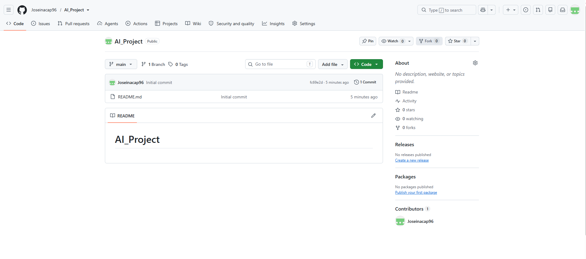
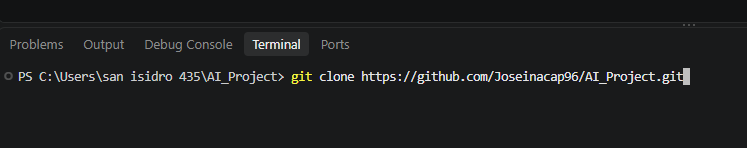
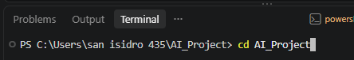
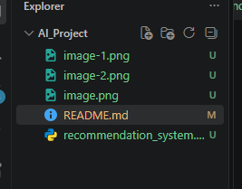
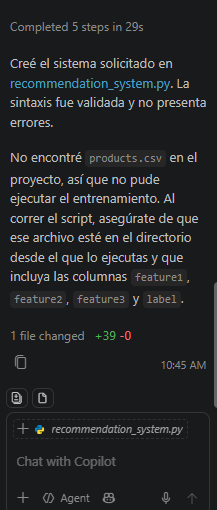
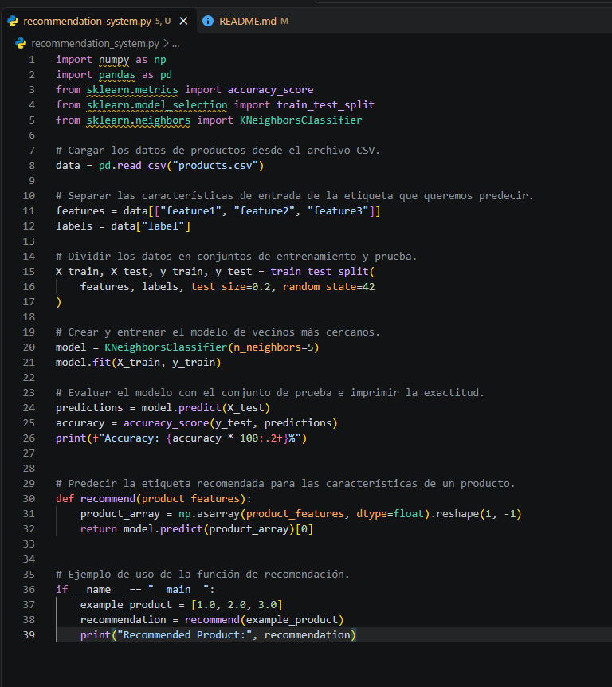

# AI_Project

     

en la imagen adjunta se ve la cuenta creada y el repositorio creado "AI_Project"

En la imagen adjunta se ve que se clona el repositorio de manera local

se ingresa a la carpeta de "AI_Project"

se crea el archivo con el nombre “recommendation_system.py”

usando guthub copilot se genera codigo inicial

codigo creado 